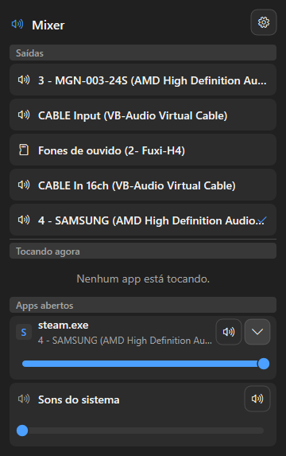
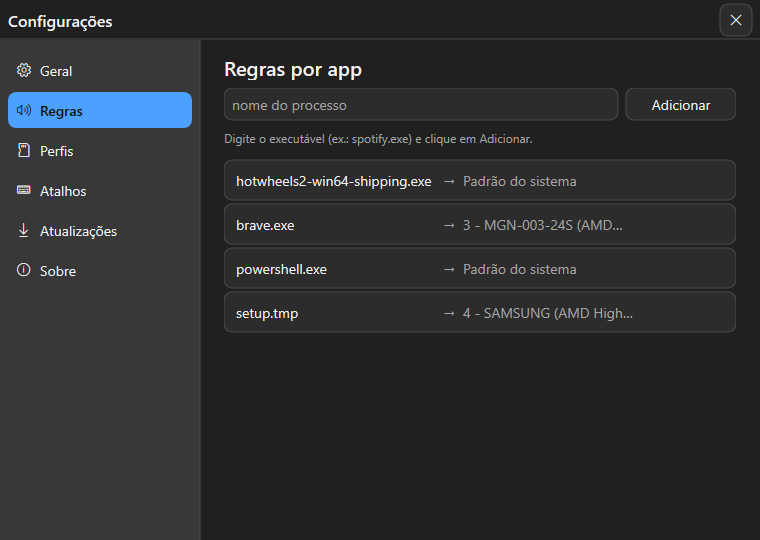
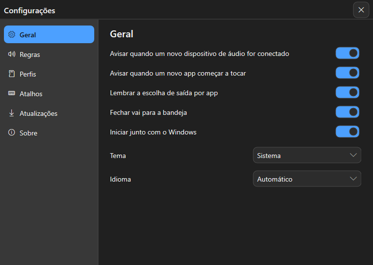
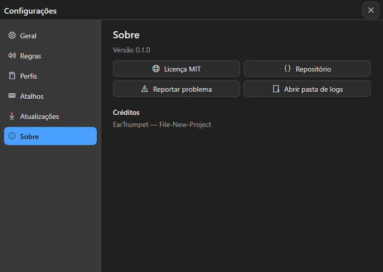

<p align="center">
  
</p>

<h1 align="center">SoundInt</h1>

<p align="center">
  <b>App de bandeja ultraleve que roteia a saída de som por aplicativo no Windows 10/11</b>
</p>

<p align="center">
  <a href="https://github.com/brunocsilva41/SoundInt/actions/workflows/ci.yml"></a>
  <a href="https://github.com/brunocsilva41/SoundInt/releases"></a>
  <a href="LICENSE"></a>
  
  
</p>

<p align="center">
  Feito em <b>C++17 + Win32 + Direct2D</b> — sem Electron, sem runtime, sem serviço.
  Um único exe com CRT estática que fica parado na bandeja esperando eventos.
</p>

App de bandeja (tray) para Windows 10/11 que vigia seus dispositivos e
sessões de áudio e **roteia a saída de som por aplicativo** — o Spotify no
fone, o navegador nas caixas, o Discord no microfone — sem tocar no mixer do
sistema.

## Prints

### Mixer — saídas, apps em execução e regras persistidas



O mixer lista as saídas disponíveis, o que está tocando agora, os **apps
abertos** com a saída roteada (clique no chevron re-roteia e persiste a
regra) e o volume dos sons do sistema.

### Configurações — regras por app com nome amigável do dispositivo



Cada `AppRule` mostra o processo e o destino em linguagem humana
(`brave.exe → 3 - MGN-003-24S (AMD High Definition Audio)`), resolvido por
ID de dispositivo; `Padrão do sistema` limpa a regra.

### Configurações — geral e sobre

<table>
  <tr>
    <td align="center"><br><sub>Geral: avisos, inicialização, tema e idioma</sub></td>
    <td align="center"><br><sub>Sobre: versão, licença, logs e reporte de problemas</sub></td>
  </tr>
</table>

## Funcionalidades

- **Modais inteligentes** — aviso quando um novo app começa a tocar ou um
  novo dispositivo é conectado, com escolha de saída em um clique.
- **Mixer por app** — volume e mudo por sessão, agrupadas por processo, com
  fluxo instantâneo de eventos (sem polling).
- **Regras e perfis** — `AppRule` por processo ("Spotify sempre no fone"),
  `ArrivalRule` ("ao conectar o fone: vira default e aplica regras") e perfis
  comutáveis.
- **Hotkeys globais** — atalhos configuráveis (`RegisterHotKey`) para abrir o
  mixer, ciclar saídas ou trocar de perfil.
- **Troca automática de default** — detecção de dispositivos via
  `IMMNotificationClient` (conexão, desconexão, default do sistema).
- **Atualizador próprio** — checa as GitHub Releases, valida SHA256 e aplica
  a atualização (canais stable/beta).
- **Perfícil de viver junto** — inicia com o Windows, fecha para a bandeja,
  logs rotativos em `%LOCALAPPDATA%\SoundInt`.

## Requisitos

- Windows 10 versão 1903 (build 18362) ou superior, **x64**
  (Windows 11 também).
- Nada mais: a CRT é estática e o app não instala serviço.

## Instalação

1. Baixe o `SoundInt-Setup-x.y.z.exe` da
   [página de releases](https://github.com/brunocsilva41/SoundInt/releases/latest);
2. Execute — instala **por usuário**, sem UAC, em
   `%LOCALAPPDATA%\Programs\SoundInt`;
3. Marque "Iniciar com o Windows" se quiser.

Alternativa **portátil**: baixe o `SoundInt-x.y.z-portable.zip`, extraia em
qualquer pasta e rode o `SoundInt.exe`.

Canal beta: as builds `nightly-*` são publicadas como *prerelease* e podem
ser habilitadas no app (Configurações → Atualizações → canal beta).

## CI/CD — como a gente garante qualidade

Nada de pipeline decorativo: cada parte do sistema é verificada
independentemente e a publicação exige aprovação.

### CI (`ci.yml`) — a cada push/PR em `main`

1. **`1 - build (Windows x64 Debug)`** — configura o CMake x64, compila tudo
   com `/W4` e roda o `ctest` registrado.
2. **`2 - test (<parte>)`** — matriz paralela com `fail-fast: false`:
   `core`, `audio`, `ui`, `update`, `app` e `full` (suíte completa). Cada
   parte reporta isolada: se uma falha, **só ela fica vermelha** e o
   _Re-run failed jobs_ refaz apenas ela — o build não repete.

**Critérios de sucesso (exigidos pela proteção de `main`):** os 7 checks
acima precisam estar verdes, o PR precisa de **1 aprovação** e de estar
atualizado com a branch de destino. Push direto em `main` é bloqueado para
quem não está na lista de bypass.

### Release (`release.yml`) — tag `v*`

Seis etapas encadeadas: **validate** (CHANGELOG/versão) → **build-test**
(suítes) → **package** (instalador Inno Setup + portátil + SHA256) →
**sign** (assinatura condicional) → **draft** (attestation de proveniência
OIDC dos assets + release em rascunho) → **publish** (exige **aprovação
manual** no environment `production`). Um _dry run_ é possível via
`workflow_dispatch`.

### Nightly (`nightly.yml`)

Cron diário às 03:00 UTC (+ disparo manual): build Release, portátil e
prerelease `nightly-AAAAMMDD-HHMM` no canal beta.

## Reportar um problema

Use o
[template de relatório de bug](https://github.com/brunocsilva41/SoundInt/issues/new?template=bug_report.yml) —
quanto mais completo (versão, build do Windows, passos, log em
`%LOCALAPPDATA%\SoundInt\logs`), mais rápido a correção. Dúvidas e ideias
vão para [Discussions](https://github.com/brunocsilva41/SoundInt/discussions);
**vulnerabilidades** para o fluxo privado do [`SECURITY.md`](SECURITY.md)
(nunca em issue pública).

## Build a partir do código

Pré-requisitos: Visual Studio 2022 Build Tools (workload "C++ Windows") e
CMake 4.x.

```powershell
git clone https://github.com/brunocsilva41/SoundInt.git
cd SoundInt

# configurar e compilar (Debug)
cmake -B out/dev -A x64 -DCMAKE_BUILD_TYPE=Debug
cmake --build out/dev --config Debug

# testes
out\dev\Debug\soundint_tests.exe

# Release
cmake -B out/dev-rel -A x64 -DCMAKE_BUILD_TYPE=Release
cmake --build out/dev-rel --config Release
```

Alvos: `core`, `audio`, `ui`, `update`, `SoundInt` e `soundint_tests`.
Detalhes da arquitetura em [`docs/architecture.md`](docs/architecture.md) e
do fluxo de releases em [`docs/release-process.md`](docs/release-process.md).

> **Nota para agentes de IA**: este repositório usa `AGENTS.md` +
> `docs/OWNERSHIP.md` para execução paralela de agentes. Leia os dois antes
> de editar qualquer arquivo.

## Aviso: API não-documentada

O roteamento por aplicativo usa a interface **`Windows.Media.Internal.AudioPolicyConfig`**,
que é **interna e não-documentada** do Windows (é o que EarTrumpet e similares
usam). Ela:

- não possui garantia de estabilidade entre builds do Windows;
- pode mudar ou sumir em futuras atualizações do sistema;
- é acessada via `RoGetActivationFactory` com duas variantes de vtable
  (>= 21H2 e downlevel).

O SoundInt trata falhas graciosamente (a função deixa de funcionar, o resto do
app continua), mas **não há garantia** de compatibilidade com versões futuras
do Windows. Aproveite enquanto durar.

## Estrutura do repositório

```
src/core      tipos, EventBus, store, semver, log
src/audio     device/session watchers, volume, policy config (roteamento)
src/ui        renderer Direct2D, controles, janelas (modais/mixer/menu/settings)
src/update    atualizador via GitHub Releases
src/app       shell do tray, wiring e políticas
installer/    script Inno Setup (SoundInt.iss)
.github/      workflows de CI, nightly e release + templates de issue/PR
docs/         OWNERSHIP, arquitetura, processo de release, prints
tests/        suítes doctest por módulo
```

## Contribuindo

Leia [`CONTRIBUTING.md`](CONTRIBUTING.md) (setup, Conventional Commits, regras
de PR e de sucesso do CI/CD) e o [`CODE_OF_CONDUCT.md`](CODE_OF_CONDUCT.md).
Relatos de segurança: [`SECURITY.md`](SECURITY.md).

## Licença

MIT © 2026 Bruno Silva — veja [`LICENSE`](LICENSE).
